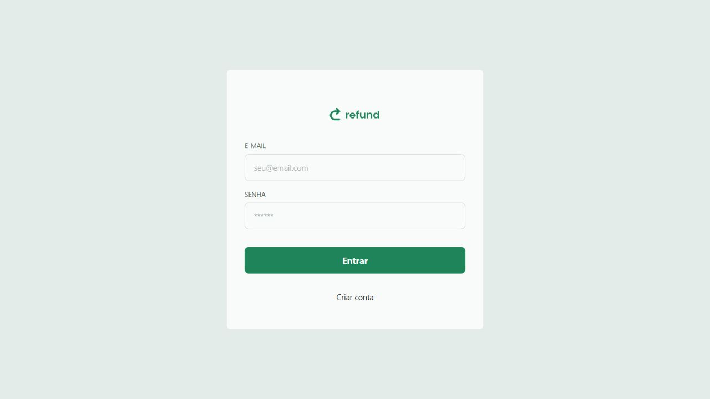
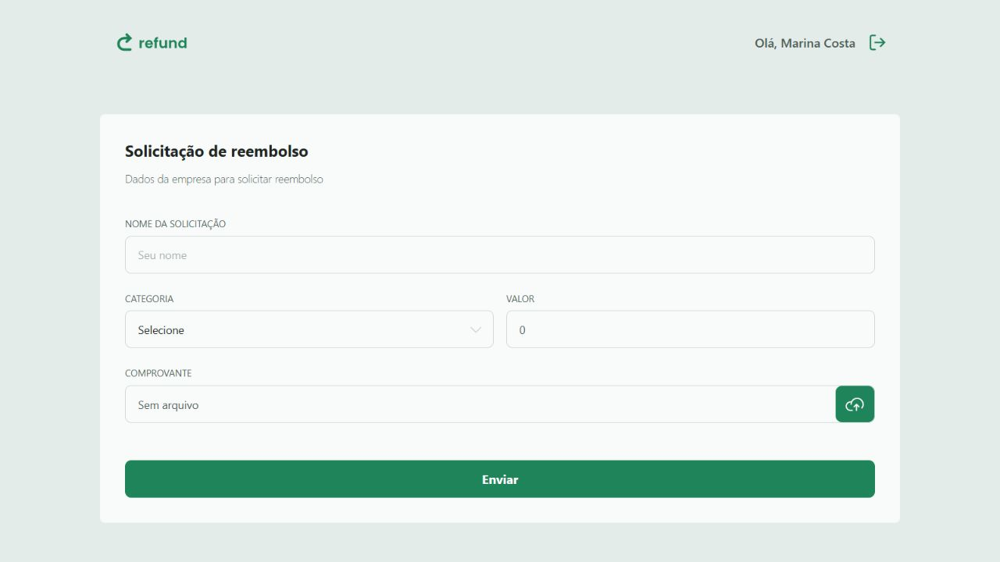
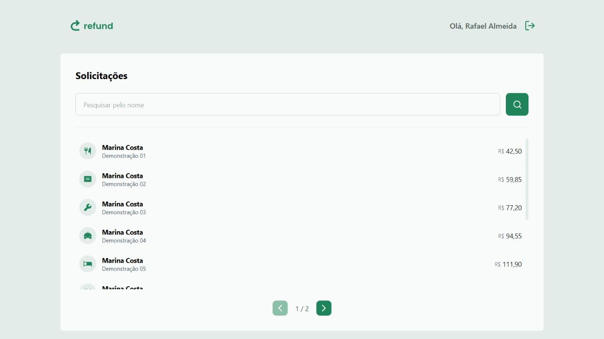

# Refund

Aplicação full stack para solicitar e gerenciar reembolsos corporativos. O projeto separa a experiência de colaboradores e gestores, protege as rotas por perfil e oferece pesquisa e paginação para acompanhar solicitações.

## Visão geral

### Acesso



### Solicitação do colaborador



### Painel do gestor



## Entregas do projeto

- 6 endpoints REST para cadastro, autenticação, upload e reembolsos.
- 2 perfis de acesso: `employee` e `manager`.
- Cadastro público restrito ao perfil `employee`.
- Senhas protegidas com hash usando bcrypt e autenticação com JWT.
- Upload de comprovantes JPEG ou PNG com limite de 1 MB.
- Painel do gestor com pesquisa por nome e paginação de 10 registros.
- Seed opcional com 2 usuários e 15 solicitações para demonstração local.

## Tecnologias

**Front-end:** React, TypeScript, Vite, Tailwind CSS, React Router, Axios e Zod.

**Back-end:** Node.js, Express, TypeScript, Prisma, SQLite, JWT, bcrypt, Multer e Zod.

## Como executar

### Pré-requisitos

- Node.js 20.19 ou superior (ou 22.12+)
- npm

### 1. API

```bash
cd api
cp .env.example .env
npm ci
npm run prisma:generate
npm run prisma:migrate
npm run seed:demo
npm run dev
```

No PowerShell, substitua `cp .env.example .env` por:

```powershell
Copy-Item .env.example .env
```

Antes de iniciar, edite `api/.env` e defina uma chave JWT segura. A API será iniciada em `http://localhost:3333`.

| Variável | Finalidade |
| --- | --- |
| `JWT_SECRET` | Chave usada para assinar os tokens de autenticação |
| `PORT` | Porta HTTP da API; o valor padrão é `3333` |
| `DEMO_PASSWORD` | Senha dos usuários criados por `npm run seed:demo` |

### 2. Front-end

Em outro terminal:

```bash
cd web
cp .env.example .env
npm ci
npm run dev
```

No PowerShell, use novamente `Copy-Item .env.example .env`. A interface estará disponível no endereço informado pelo Vite, normalmente `http://localhost:5173`.

| Variável | Finalidade |
| --- | --- |
| `VITE_API_URL` | URL pública da API |

## Dados de demonstração

Após configurar `DEMO_PASSWORD` e executar `npm run seed:demo`, use:

| Perfil | E-mail |
| --- | --- |
| Colaborador | `employee@refund.local` |
| Gestor | `manager@refund.local` |

A senha é o valor definido localmente em `DEMO_PASSWORD`; nenhuma senha de demonstração fica gravada no repositório.

## Rotas da API

| Método | Rota | Acesso | Descrição |
| --- | --- | --- | --- |
| `POST` | `/users` | Público | Cadastra um colaborador |
| `POST` | `/sessions` | Público | Autentica o usuário |
| `POST` | `/uploads` | Colaborador | Envia um comprovante |
| `POST` | `/refunds` | Colaborador | Cria uma solicitação |
| `GET` | `/refunds` | Gestor | Pesquisa e pagina solicitações |
| `GET` | `/refunds/:id` | Autenticado | Exibe os detalhes de uma solicitação |

Envie o token JWT no cabeçalho `Authorization: Bearer <token>` nas rotas protegidas.

## Validação do projeto

```bash
cd api
npm run typecheck
npm audit

cd ../web
npm run build
npm audit
```

## Publicação

O front-end pode ser publicado em um serviço de aplicações estáticas, configurando `VITE_API_URL` com a URL da API. A API precisa de um ambiente Node.js com `JWT_SECRET` e volume persistente para o banco SQLite e os comprovantes.

Para uma versão de produção escalável, a evolução recomendada é armazenar os dados em PostgreSQL e os comprovantes em um serviço de objetos, como S3 ou Cloudflare R2.

## Autor

[Wellington Barbosa](https://github.com/wellingtonbarbosadev)
